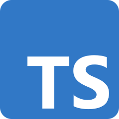

<center>

# Getting Started With Deno
</center>

<p align="center">
  
</p>

<center>

<span style="font-size: small;">*Written By:*</span> Chris Kettenbach 
</center>


## What is it?


As the web site says, [Deno](https://deno.land) is a simple, modern, and secure TypeScript and JavaScript runtime that uses Chrome’s V8 JavaScript engine. It’s built using the Rust programming language. This contrasts with [Node](https://nodejs.org) which is built using C and C++. It’s from the creator of Nodejs, [Ryan Dahl](https://en.wikipedia.org/wiki/ryan_dahl). Notice it’s an anagram of Node. Perhaps hinting at rearranging or fixing parts of Node? Both platforms are open source.

## Why do I want to learn it?


As a developer you should aim to deliver high quality maintainable code that lasts the test of time. You should build code with your future self and others in mind. Deno shines here. TypeScript is a first-class citizen. Most new JavaScript applications are written in TypeScript. This includes React applications, Angular, NodeJS and ExpressJS. The list goes on and on. Also, most classic libraries are either ported to TypeScript or @types are provided by 3rd parties. The reason being developers and customers want to take full advantage of the rich tooling TypeScript brings to a project. Variables and Functions are strongly typed. This catches many coding errors long before they see the light of production. Variables aren’t left undefined or changed sporadically throughout the application lifecycle. This makes for much more reliable predictable applications.  
Other reasons include vastly improved security over Node as well many features out of the box that you are left to add in a traditional JavaScript application.


## How is it different?



As I have indicated, [TypeScript](https://www.typescriptlang.org/) is the language of choice and is supported on day zero. Other differences include no package.json file, no tsconfig.json file, dependency management, and the runtime is secure by default.

tsconfig.json is traditionally used to configure the typescript compiler (tsc). You can optionally include a configuration file, but I find it is not generally needed. Deno enables the strict options by default. Such as ‘NoImplicitAny’, ‘StrictNullChecking’ to name a few.

There is also no ‘node_modules’ directory and no package manager. Dependencies (other libraries required for the application) are imported directly into local modules. The fully qualified URL/version and file extension are required. 

<center>

</center>

This can quickly become cumbersome as the application grows. A standard practice is Deno is to create a deps.ts file. The idea is to import everything is one place and re-exported. Then local modules only need to reference the deps.ts file and the functions they need.

<center>


</center>

Versioning is maintained in user created lock.json file. The filename and version info are hashed in this file. 

<center>

</center>

Fetch web api is also included in the Deno runtime. Node requires 3rd party modules for http callouts.

<center>

</center>

## So how do I install it?


Deno works on macOS, Linux, and Windows. Deno is a single binary executable. It has no external dependencies.

<br>
<br>


Use Shell (macOS and Linux):

```bash
curl -fsSL https://deno.land/x/install/install.sh | sh
```

Using Powershell (Windows):

```powershell
iwr https://deno.land/x/install/install.ps1 -useb | iex
```

To test your installation, run `deno --version`. If this prints the Deno version to the console the installation was successful.


## What tools do I need?


One of the beautiful things about Deno is tools included out of the box.  Bundling, linting, formatting, testing are all built it. Normally you would need 3rd party libraries such as WebPack, ES Lint, Prettier, Jest etc...  Any Integrated Development Environment will likely do. I use VS Code and the Deno extension. If you search the vscode extension gallery for Deno, you’ll quickly find it. I have included a link below. One small gotcha, is that you need to go into the workspace settings file and enable the plug-in.

<figure>
  
  <figcaption>VS Code Deno extension</figcaption>
</figure>

<figure>
  
</figure>


## What are some use cases?


- Many tools are included out of the box. This can reduce time to delivery. Developers aren’t left configuring their environment for countless hours or days.
- It adds on existing developer experience. It’s familiar to front end and backend. Developers can leverage TypeScript and JavaScript knowledge.
- Teams using a unified developer platform. Both front end and backend code can be developed by the same teams.  No silo development. Everyone is coding in the same language.  This obviously also promotes code reuse.
- Rapid API/prototyping delivery.  Proof on concepts can quickly be created and demoed to stakeholders.  Very fast time development cycles


## What are my final thoughts?


I was really impressed with Deno.  I think it has a great future and is definitely worth learning.  I don’t see it killing Node any time soon as there are just so many applications out there using and relying on it.  I do feel it was a major win to have TypeScript supported and to use Rust to build it.  I think startups and smaller companies will be the earlier adopters and that in time larger enterprises will come on board.  This was also true at one time about Node.  No big industry took it seriously. Now its basically everywhere.  I see Deno eventually in that same space.  These are of course just my opinions.  Bottom line, give it a try.  I think you’ll really like it.

## Links and Learn More
[Cheat Sheet](https://droces.github.io/Deno-Cheat-Sheet/) • [Github](https://github.com/denoland/deno) • [@deno_land](https://twitter.com/deno_land) • [Discord](https://discord.gg/deno) • [Docs](https://deno.land/manual) • [VS Code](https://code.visualstudio.com/) • [Deno Extension](https://marketplace.visualstudio.com/items?itemName=denoland.vscode-deno) • [Contact Me](mailto:christopherk@logic2020.com)
